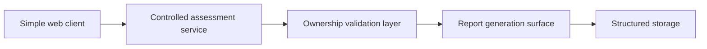

# Architecture

## High-level architecture
- Classification: ADJACENT SYSTEM
- Category: adjacent-system
- Confidence: HIGH
- Exposure risk: MEDIUM

## Public-safe component view
- Simple web client
- Controlled assessment service
- Ownership validation layer
- Report generation surface
- Structured storage

## Boundary notes
- This diagram is intentionally high level.
- No internal routes, private services, live storage names, or deployment details are published.
- The public-safe view is limited to product layers that can be discussed without weakening security.
