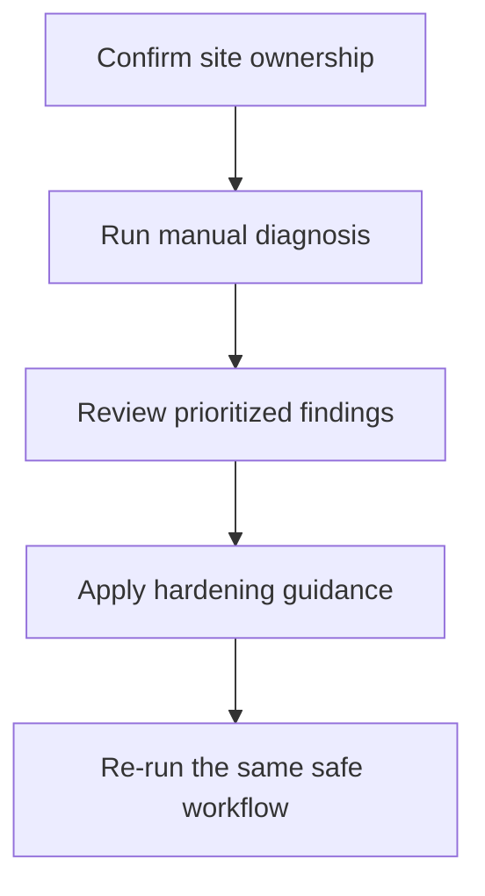

# Workflow

## High-level functional workflow
1. Confirm site ownership
2. Run manual diagnosis
3. Review prioritized findings
4. Apply hardening guidance
5. Re-run the same safe workflow

## Publication boundary
- The workflow is intentionally simplified.
- No internal rules, private thresholds, or sensitive processing detail are described here.
